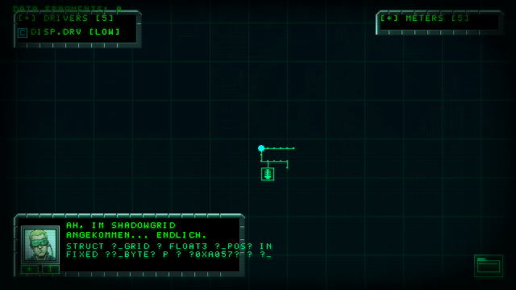

# ⚡ SHADOWGRID // TERMINAL OS v4.2

> **🎮 LIVE PLAYABLE BROWSER VERSION**:  
> ### 👉 [**PLAY SHADOWGRID IN YOUR BROWSER HERE**](https://darkjoy2k2-crypto.github.io/shadowgrid/) 👈
> *(WebAssembly / Pygbag powered - runs directly in Chrome, Firefox & Edge)*

---

## 📸 Screenshots

| Start Screen & Video Intro | In-Game Cyber Deck & CRT Phosphor Glow |
| :---: | :---: |
|  |  |

---

## ⚙️ Core System Features

- 🟢 **Vault66-Inspired CRT Post-Processor (`GlitchPostProcessor`)**:
  - **Additive Phosphor Glow**: Crisp luminous green phosphor aura (`#00E676`) around all UI text, map traces, and nodes with 100% flicker-free background stability.
  - **Ultra-Slow Scanline Scroll**: Fine interlace rastering (`21/255` opacity) descending smoothly at `3px/s`.
  - **Vault66 Corner Vignette**: Authentic CRT cathode monitor curvature and corner shading.
  - **Ambient Micro-Glitches**: RGB chromatic channel shifts and slice tearing triggered dynamically by in-game threat levels.
  - **Unglitched Death Screen**: Glitches automatically disable on Game Over for 100% crisp readability.

- 🖥️ **Cyber Terminal Feed (`CyberTerminalFeed`)**:
  - Fast-scrolling cryptic Sanskrit / Matrix / C# fantasy script execution stream (`async Task<⟁> ∇_SyncCore`, `[λ] => decrypt(0x8F9A)`).

- 🌌 **Center-Anchored Dual-Layer Parallax Background**:
  - Deep backdrop layer + coarse pulsating grid layer anchored at screen center `(320, 180)` for realistic zoom scaling.

- 🎵 **Spatial 2D Audio Engine (`SoundManager`)**:
  - Dynamic panning, distance falloff, and pitch variations.

---

## 🚀 Quickstart & Local Run

### Prerequisites
- Python 3.10+
- `pygame-ce` & `numpy`

### Installation
```bash
git clone https://github.com/darkjoy2k2-crypto/shadowgrid.git
cd shadowgrid
pip install -r requirements.txt # or pip install pygame-ce numpy
```

### Launch Game
```bash
python run.py
```

---

## 🌐 GitHub Pages Deployment

The repository includes a GitHub Actions workflow (`.github/workflows/deploy-pages.yml`) that automatically compiles and deploys the latest Pygame WebAssembly build to GitHub Pages on every push to `main`.

---

*System Kernel // Cyberdeck OS v4.2 — Shadowgrid Project*